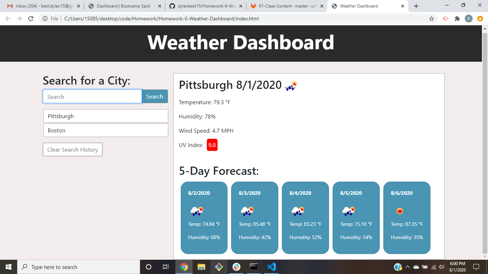

# Weather-Dashboard
This website allows the user to search for a city and they will receive the current weather results and the 5 day weather forecast for that city. The weather results includes the temperature, humdidity, wind speed, and uv index. The uv index is also color coded for how severe it is. The results also include weather icons for the current weather and each day within the 5 day forecast. In addition, this website will save the user's searches so that they may revisit them easily again, and also allows the user to clear their past searches if they wish. This website should act as a simple weather app for the city of choice.

https://dylanbest15.github.io/Homework-6-Weather-Dashboard/